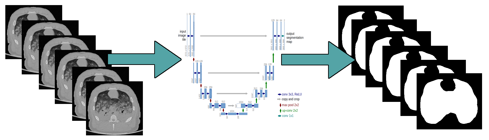

# Lungs image segmentation U-net
The main part of the solution, it contains U-net model, performs sets splitting, augmentation, learning and segmentation.  
This repo operates on png images. If you have raw files to work on you can go to [lungs-img-segmentation-preprocessing](https://github.com/Stadzior/lungs-img-segmentation-preprocessing). If you already have your segmentation results you can skip to [lungs-img-segmentation-postprocessing](https://github.com/Stadzior/lungs-img-segmentation-postprocessing). 
The following project was tested on Python 3.6.8 64bit on Windows 10.

U-net is a convolutional neural network designed to process biomedical images: https://lmb.informatik.uni-freiburg.de/people/ronneber/u-net/ 
Model was built based on zhixuhao U-net implementation, check out his repository here: https://github.com/zhixuhao/unet

## Quick config:  
1. Download Miniconda for Windows from [here](https://repo.anaconda.com/miniconda/Miniconda3-latest-Windows-x86_64.exe).  
2. Install Miniconda  
   - Install for **Just Me**  
   - Add Anaconda to my **PATH enviromantal variables**   
   - **Untick** "*Register Anaconda as my default Python 3.7*" (If you have another python copy installed)     
3. In cmd: 
   - `conda create -n tfgpu tensorflow-gpu SimpleITK pillow keras matplotlib scikit-image pip opencv`  
   - `activate tfgpu`    
4. Run `main.py` using `tfgpu` pyenv with cmd or your favorite IDE (e.g. VS Code, Spyder, Atom) configured to work with python envs.

## Useful cmds:
1. List envs: `conda info --envs`
2. Install package on env: `conda install -n env_name pypng`
3. Add channel to conda: `conda config --env --add channels channel_name`
4. Remove channel from conda: `conda config --remove channels channel_name`
5. Show channels: `conda config --show channels`

#### Installing pip modules within miniconda env:
1. Install pip inside your env: `conda install -n env_name pip`
2. Get inside env with Anaconda prompt: `conda activate env_name`
3. Install module using pip inside env: `pip install module_name`

## Quickstart:
1. Prepare input files and move CT images to `.\data\source\image` and binary masks to `.\data\source\mask`.
2. Define parameters for augmentation, sets splitting, training and segmentation and others in [main.py](main.py).
3. Run [main.py](main.py).
4. The progress should be visible on output window and under http://localhost:6006/.
5. After the sets splitting testing set is copied to `.\data\test` and training set is copied to: `.\data\train`.
    - aug - contains augmentation results
    - image - contains CT images
    - mask - contains binary masks
6. After the process termination in `.\data\results\result_[]` you can find:
    - segmentation results as 8bit .png files
    - best trained weights as .hdf5 file (it is a large file ~300MB)
    - process logs as .txt file
    - tensorboard tfevents file
    

## DISCLAIMER
Solution created as a part of my master degree thesis. If you want to use any part of those three solutions please add a reference to the following: 
<i>Kamil Stadryniak, "Segmentation of limited opacity CT lung images with the use of convolutional neural networks", Lodz University of Technology, 2019</i> 

Another parts of the solution can be found here: 
[lungs-img-segmentation-preprocessing](https://github.com/Stadzior/lungs-img-segmentation-preprocessing) 
[lungs-img-segmentation-postprocessing](https://github.com/Stadzior/lungs-img-segmentation-postprocessing)

Examples included in `.\data` are a small part of larger dataset gathered by Centre de Recherche en Neurosciences de Lyon in cooperation with Université Claude Bernard Lyon 1, INSA, Centre de Recherche en Acquisition et Traitement de l'Image pour la Santé.

I've got the permission to publish just enough of them to make a working example thus they cannot be used in any kind of research or commercial solution without proper permission.